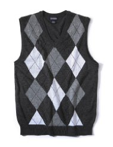

# SweeterVest



Like @tpope's [dotfiles](http://github.com/tpope/tpope), here be dragons.

This is as much an exercise in creating my first vim plugin, learning vimscript, and testing with [vimrunner](https://github.com/AndrewRadev/vimrunner) as it is extracting something from my test flow for coworkers to use.  Bottom line, this is experimental.  Use at your own risk, especially if you work in Test::Unit.

## Installation

I personally use [Vundle](https://github.com/gmarik/vundle) after years with [Pathogen](https://github.com/tpope/vim-pathogen).  Both are great plugins that offer documentation on how to install vim-sweeter-vest.  That said, I have only ever tested installation with Vundle.

## Getting Started

  The plugin creates the following commands:

  ```vim
  :SweeterVestRunTest
  ```
  Runs the current test relative to the current line when the command is executed.

  ```vim
  :SweeterVestRunFile
  ```
  Runs all tests available in the current file.

  ```vim
  :SweeterVestRunAll
  ```
  Runs rake when a Rakefile is present.  Otherwise, runs available tests.

  ```vim
  :SweeterVestRunLast
  ```
  Runs the last command successfully executed by SweeterVest.

  ```vim
  :SweeterVestRunContext
  ```
  For RSpec, runs all tests in the nearest parent describe or context block.  For Cucumber, runs the nearest parent scenario.  Test::Unit has not yet been implemented.

  ```vim
  :SweeterVestRunFeatures
  ```
  Runs all flavors of feature files depending on what's available, including cucumber features and spec/features and spec/acceptance files

  ```vim
  :SweeterVestRSpecSeed <seed>
  ```
  Run RSpec commands with a specific seed.  The seed is cleared after each run.  Protip: Use SweeterVestRunLast to continuously run a command with a given seed.


  The following mappings are provided by default:

  ```vim
  nnoremap <leader>rt :SweeterVestRunTest<cr>
  nnoremap <leader>rf :SweeterVestRunFile<cr>
  nnoremap <leader>ra :SweeterVestRunAll<cr>
  nnoremap <leader>rl :SweeterVestRunLast<cr>
  nnoremap <leader>rc :SweeterVestRunContext<cr>
  nnoremap <leader>rF :SweeterVestRunFeatures<cr>
  nnoremap <leader>rs :SweeterVestRSpecSeed 
  ```


## Customize

Coming...
